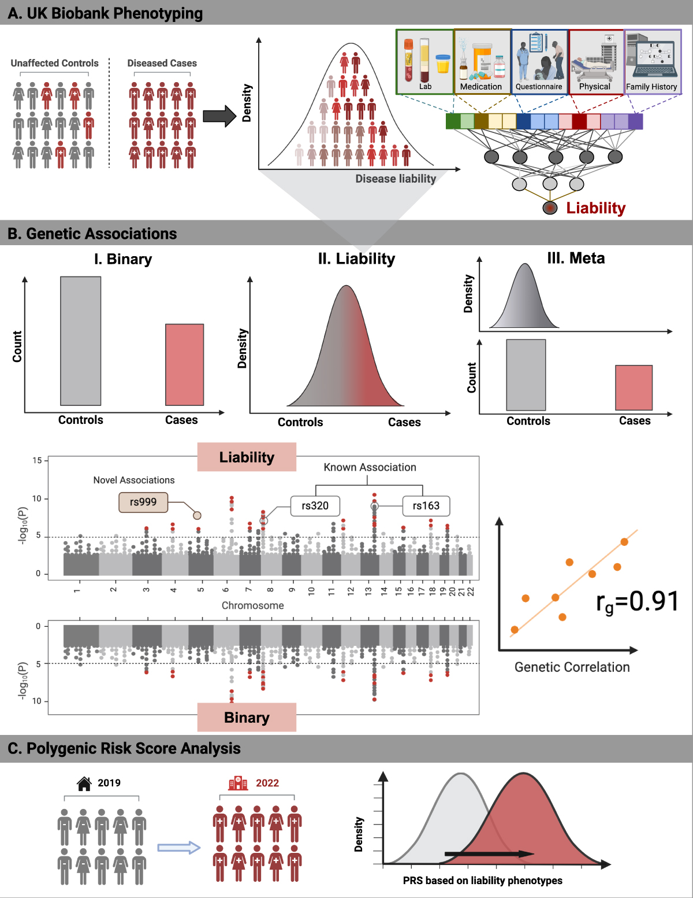

# Genetic association studies using disease liabilities from deep neural networks

This repository contains scripts for GWAS analysis. The preprint is [online](https://www.medrxiv.org/content/10.1101/2023.01.18.23284383v1). 



## Installation

To replicate the analysis you will have to install the LDAK software > v5.2. Installation instructions and documentation can be found [here](https://dougspeed.com/).

## Usage

First, you will have to prepare your phenotypes in [PLINK Format](https://www.cog-genomics.org/plink/2.0/input#pheno). This pipeline expects phenotypes to be adjusted for covariates. 

The analysis was performed on directly genotyped data from the UK Biobank. Data is expected to be in [PLINK Format](https://www.cog-genomics.org/plink/1.9/formats#bed). Please also provide a list of samples to be included (homogeneous ancestry and unrelated individuals) and markers (i.e. SNP) that passed quality control (e.g. MAF > 0.01). For sex-specific analyses, provide the corresponding files of phenotypes and list of included individuals of the sex of interest.

For the LDAK-Bolt-Predict procedure, 65 functional annotations, of which 64 can be [downloaded](http://dougspeed.com/bldldak/) are needed. The final annotation depends on the genetic data at hand with code provided in the Snakefile.

The pipeline we followed is outlined in the **Snakefile**. Once all input data files and paths are specified, computation can be launched with the command ```snakemake```. Cluster usage for snakemake is described [here](https://snakemake.readthedocs.io/en/stable/executing/cluster.html).

